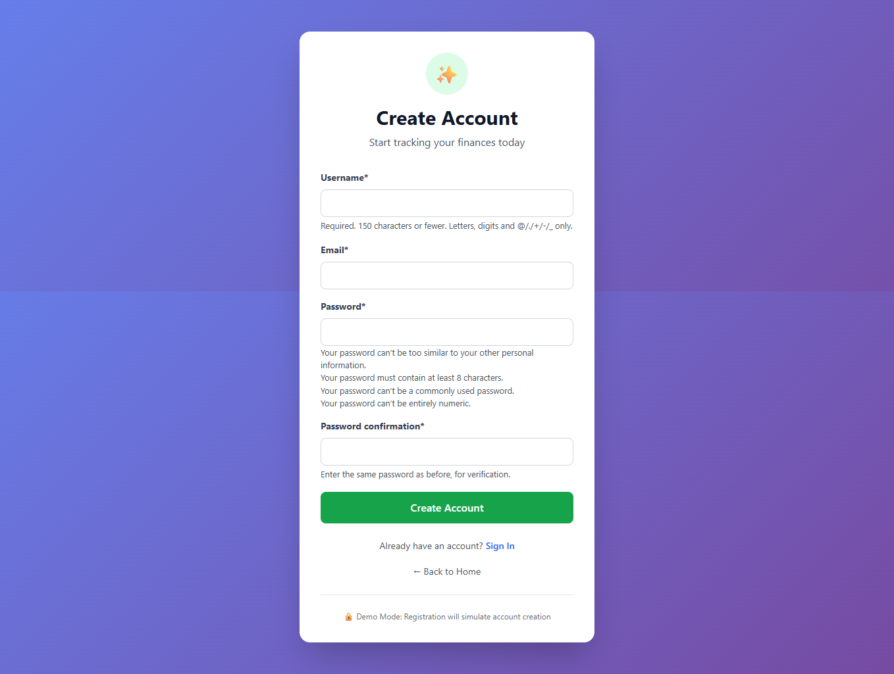
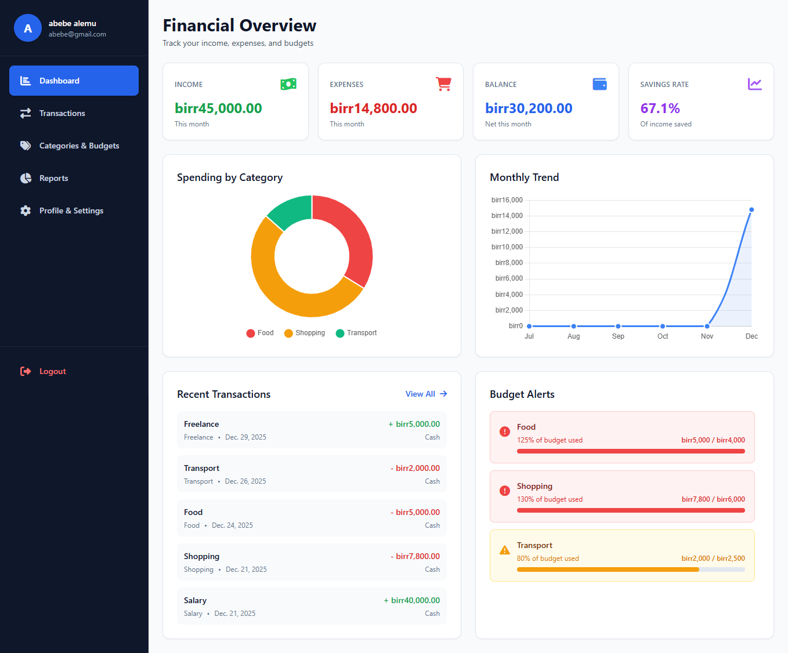
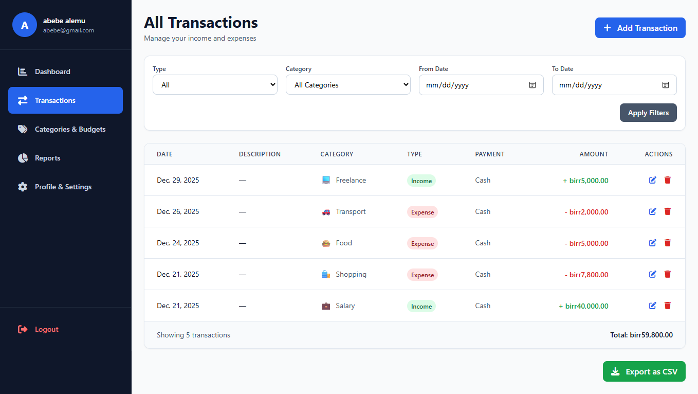
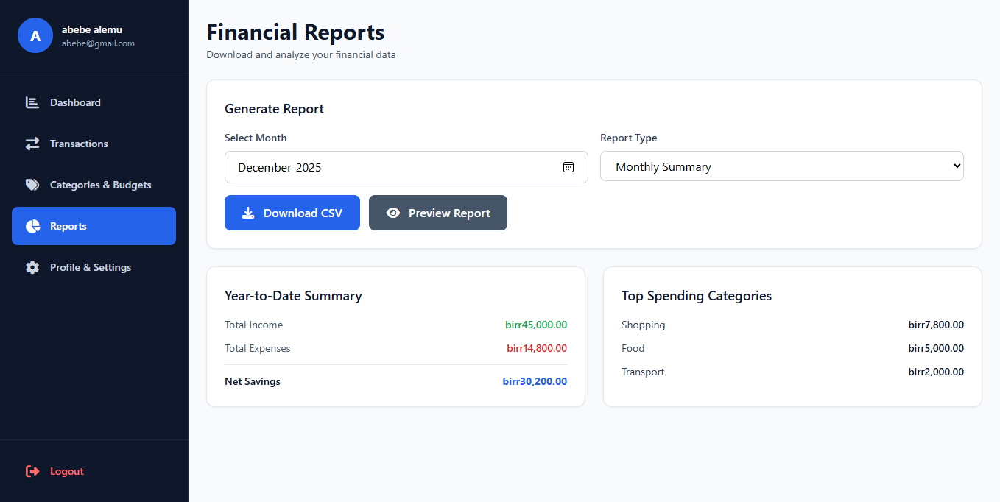
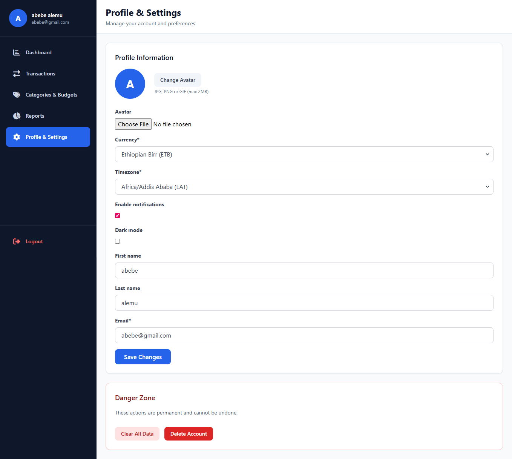

# 💰 Personal Finance Tracker

A modern Django web application for managing personal finances with comprehensive budgeting, expense tracking, and financial reporting features.


## ✨ Features

- 📊 **Dashboard Overview**: Visual financial summary with charts and metrics
- 💳 **Transaction Management**: Track income and expenses with categorization
- 🎯 **Budget Planning**: Set and monitor monthly budgets by category
- 📈 **Financial Reports**: Generate detailed reports and analytics
- 👤 **User Profiles**: Customizable settings with avatar support
- 🌐 **Responsive Design**: Works seamlessly on desktop and mobile devices

## 📱 Application Screenshots

### Landing Page

*Modern landing page with clear value proposition and call-to-action*

### Authentication

*Secure user registration with password validation*

### Core Features
| Dashboard | Categories & Budgets |
|-----------|----------------------|
|  |  |
| *Comprehensive financial overview with charts and alerts* | *Budget management and category organization* |

| Transactions | Financial Reports |
|--------------|-------------------|
|  |  |
| *Income and expense tracking with filtering* | *Financial analysis and data export* |

### User Settings

*User profile management with customization options*

## 🚀 Quick Start

### Prerequisites
- Python 3.8+
- pip package manager
- Git 

### Installation
```bash
# Clone and navigate to project
cd personal_finance_tracker

# Create and activate virtual environment
python -m venv venv
# Windows:
venv\Scripts\activate
# Mac/Linux:
source venv/bin/activate

# Install dependencies
pip install django==4.2.7 crispy-forms

# Setup database
python manage.py migrate

# Create superuser (optional)
python manage.py createsuperuser

# Run development server
python manage.py runserver
